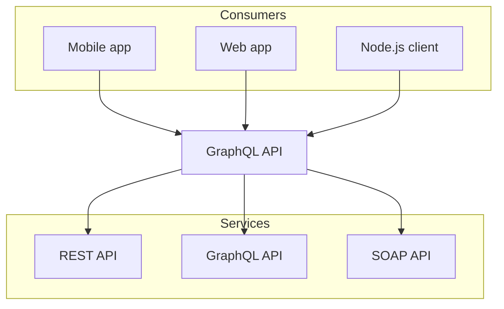

# API Reference

Complete API documentation for the OmniOptimize SDK.

## Core Methods

### initialize()

Initialize the SDK with your configuration.

```javascript
import { OmniOptimize } from "@omnisdk/core";

const omni = new OmniOptimize({
  apiKey: "your-api-key",
  region: "us-east-1",
});
```

```ansi
 ✓ src/index.test.ts (1)
   Test Files  1 passed (1)
        Tests  1 passed (1)
     Start at  23:32:41
     Duration  11ms
   PASS  Waiting for file changes...
         press h to show help, press q to quit
```



```ts twoslash
// @errors: 2540
interface Todo {
  title: string;
}

const todo: Readonly<Todo> = {
  title: "Delete inactive users".toUpperCase(),
  //  ^?
};

todo.title = "Hello";

Number.parseInt("123", 10);
//      ^|
// Just comments, so Popup will be
// not behind the viewport of `<code>`
// element due his `position: absolute` style
//
```

Renders:

### connect()

Connect to the service.

```javascript
await omni.connect();
```

## Events

- `onConnect` - Fired when connected
- `onDisconnect` - Fired when disconnected
- `onError` - Fired when an error occurs
